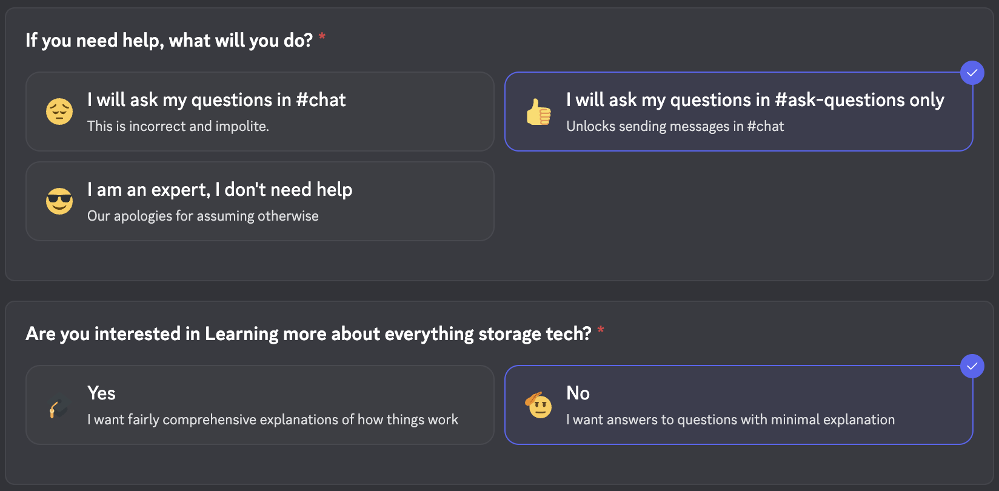
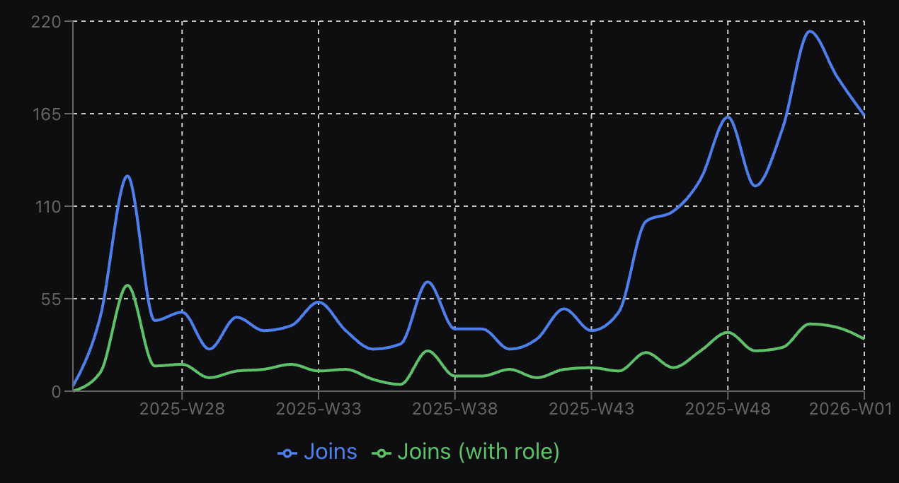

# Andrew's Thoughts
Musings on managing communities and fostering collaboration.

## Disclaimer
The views expressed here are my own and do not necessarily reflect those of the communities I am part of. Some ideas here may sound obvious, and others downright crazy. Regardless, my hope is that they spark meaningful conversations and inspire positive change. Think it over for a few days, and then decide what resonates with you.

## Table of Contents
- About me, what I do, and why I care
- What makes a good community?
- Good expectations
  - Understanding existing expectations
  - Identifying desired expectations
  - Setting expectations
- High-quality communication & feedback
    - Embracing criticism
    - Selective listening
    - Signal to Noise Ratio
- Sacrifice

## About me, what I do, and why I care
I am a programmer, biomedical engineer, open source enthusiast, Technical Minecraft player, and medical student in the United States. I have a hodgepodge of interests, but they all tie back to a central theme: having fun!

You can check out my public Github account [here](https://github.com/Andrews54757), which has some of my favorite projects such as [FastStream](https://faststream.online) (50,000+ weekly users), which is a video player tool optimized for rural internet connections and audiovisual disabilities.

I also started several organizations and communities, such as [AJS-Development](https://github.com/AJS-development) (now defunct io game development), [Soontech](https://soontech.org) (a Minecraft encoded storage community), and [Storage Tech 2](https://storagetech2.org) (a Minecraft storage archive). In addition, I have published several research papers in biomedical engineering and computer science, which is primarily what I studied in my college and master's programs (those and my main github account are mostly private).

I care about communities because they are how people come together to share ideas, collaborate, and create something great! It's so much easier to learn and grow when you have a supportive group of people around you. Plus, communities can be a lot of fun! I hope to share my experiences and insights to help others build and manage their own communities effectively, so that everyone can benefit in the long run.

## What makes a good community?
A good community is one that is enjoyable to participate in.

It sounds simple, but it's not easy to achieve. Here are the three key ingredients I've found essential:

1. Good expectations
2. High quality communication & feedback
3. Sacrifice

## Good expectations
The most important aspect of managing any community is setting good expectations. By this I don't mean a formal set of rules or guidelines (though those can help), but rather a shared understanding of what the community is about, what members can expect from each other, and what is expected of them.

In sociology, this is often referred to as "norms." They can be explicit (like a law that says you can't steal) or implicit (like the unspoken rule that you should say "bless you" when someone sneezes). I will use the term "expectations" because it is more intuitive for most people.

Expectations have a lot of power. For example, the same people who chat in a Minecraft server will behave very differently in church. You wouldn't see people sharing dank memes during mass, nor would you expect a sermon in a casual hangout. This is because the expectations for behavior, communication style, and content are different in each context. You can say that expectations set the tone and culture of a community.

Think of your community as an orchestra, and the expectations as the sheet music. If everyone is playing their part according to the same score, and have practiced enough to know their role, the result is harmonious and enjoyable. Otherwise, it will sound chaotic like the [Portsmouth Sinfonia](https://www.youtube.com/watch?v=in0wh_BxYNE). So for a community manager, every decision should be made in the context of adding to, adjusting, undermining, or reinforcing these expectations.

### Understanding existing expectations
The first step is to understand the existing expectations within the community. This can be done through surveys, interviews, or discussions.

Don't assume that just because you think there is a certain expectation, that everyone else does too. It's very easy to misinterpret people's behavior, especially online where tone and body language are absent. Try to gather as much information as possible to get a clear picture of the current expectations.

> Meten is weten (Dutch: "To measure is to know") - ASML

A very basic but very helpful way to do this is to give a survey. A survey can be as simple as a few multiple-choice questions users ask before joining a Discord server (below).

*Figure 1. Example pre-join survey questions to gauge community expectations. Members have to answer these questions before they can join the Discord server.*

Depending on what answer they pick, members appear as different colors in chats (allowing others to quickly gauge the type of help they expect). You can also track the responses and get numerical data on how the community's expectations evolve over time.

*Figure 2. Total number of joins every week, and number of those joins that are "experts." A user is counted as an "expert" if they select "I am an expert, I don't need help" in the pre-join survey.*

*Figure 3. Percentage of weekly joins that are "experts."*

> You can see from Figure 2 and 3 that around week 43, there was a noticeable increase in the number of non-expert joins, which caused a drop in the percentage of expert joins. This was caused by advertising the community on a popular forum, which attracted many new members seeking help. The lesson here is that advertising can significantly change the community's expectations, so it's important to consider how and where you promote your community.

This kind of quantitative feedback is invaluable for getting a more objective view of the community's expectations, and it is especially helpful for tracking whether your efforts to shape those expectations are working.
 
### Identifying desired expectations
Once you have a good understanding of the existing expectations, the next step is to identify the desired expectations. This can be done through discussions with community members, brainstorming sessions, or by looking at successful communities for inspiration.

It's important to involve the community in this process, as they will be the ones actually acting on these expectations. You want to make sure that the desired expectations are realistic, achievable, and aligned with the community's values. **You should not be afraid to suppress expectations that do not fulfill these criteria, even if they are popular.**

> **Example:** In Storage Tech 1, a community which posts Minecraft storage designs, there is a widespread expectation of quality in the archives. To meet these expectations, special roles were given to members who volunteered to serve as archivers and enforce archiving standards. However, there was also no expectation that the archivers would be rewarded for their efforts, and there were no clear guidelines on how many submissions an archiver was expected to review, and on what timeline.
> 
> Over time, these archivers felt the burden of maintaining quality without sufficient support, leading to burnout and eventual inactivity. To this day there are dozens of submissions that are in limbo because there are no active archivers to review them, despite having many members with the archiver role. Ultimately, the community was split into Storage Tech 2 so that things could continue moving forward with less stringent quality expectations.
> 
> **The Lesson:** Having high expectations without the capacity to meet them can be detrimental to community health.

### Setting expectations
Once the desired expectations have been identified, the next step is to set and communicate them to the community. **You're not going to get things right on the first try.** Expectation setting is an iterative process that requires constant refinement. Remember to be patient and open to feedback. Here are some ideas:

- Write a mission statement that clearly outlines the community's purpose and values.
- Give people specific roles that come with certain expectations (e.g., moderators, content creators, etc.)
- Reward and recognize members who embody the desired expectations.
- Punish members who violate the expectations (e.g., warnings, bans, etc.)
- Regularly review and update the expectations as needed.

Note that you don't always have to be public with your expectations. Sometimes it's better to keep them implicit, especially if they are more nuanced or context-dependent (eg to avoid misunderstandings, or the [Law of triviality](https://en.wikipedia.org/wiki/Law_of_triviality)). You can keep secrets, but make sure they are known to the right people.

## High-quality communication & feedback
The second key ingredient for a good community is high quality communication and feedback. This means creating an environment where members feel comfortable sharing their thoughts, ideas, and concerns, and where they can receive constructive feedback from others.

### Embracing criticism
The first step to high quality communication & feedback is embracing criticism. This means creating an environment where members feel comfortable giving you (the community manager) criticism. In other words, you need to be able to take a punch.

This is easier said than done. Most people don't like to hear negative feedback, especially if it challenges their authority or competence. However, **behind every insult or complaint there could be valuable information into how you are doing.** If you can learn to embrace criticism, you will become a better community manager and your community will thrive.

Of course, I am not asking you to be a doormat. You can express your own opinions and feelings. But try to separate your ego from your actions as leader. Remember that the goal is to improve the community, not to defend your pride.

It's also hard to make people feel comfortable giving honest feedback. People are often afraid of retaliation, or they don't want to hurt your feelings. To overcome this, you need to reassure members that you will respect them regardless of what they say. Here are some ideas:

- Create anonymous feedback channels (e.g., suggestion boxes, anonymous surveys, etc.)
- Go in a voice call or meet members in person to get their feedback. Often people are more comfortable giving honest feedback in a one-on-one or small group setting.
- Just ask! Sometimes the simplest way to get feedback is to just ask for it. Make it a regular practice to check in with members.

### Selective listening
You don't have to listen to everything everyone says. In fact, you need to practice selective listening, in other words choosing which feedback to act on and which to ignore.

The decision to ignore feedback should be a conscious one, not an automatic reaction. You should not ignore someone just because you don't like what they are saying. Instead, you should evaluate the feedback based on its merits and decide whether it is worth considering.

A key part of this is to recognize that not all feedback is created equal. Specifically, feedback from people who are more invested in the community (e.g., long-term members, active contributors, etc.) is often more valuable than feedback from casual or new members. **It's important to keep track of who is providing more value to the community, and weigh their feedback accordingly.**

> **Example:** In Storage Tech 2, there was a member who frequently complained about the quality of submissions. However, this member has not contributed any submissions themselves, nor have they helped review or improve other submissions. As a result, their feedback to the admins was worth less than that of members who are actively contributing to the community. Eventually, they lost interest and ceased with their complaints, and the community moved on.
>
> **The Lesson:** When evaluating feedback, consider the source and their level of investment in the community.

### Signal to Noise Ratio

In some cases, the volume of communication can be overwhelming. This is especially true in large communities where there are many members and a lot of activity. Just the act of reading through all the messages can be exhausting, let alone responding to them. This is not just an issue for community managers, but for all members. To address this, you need to find ways to improve the signal to noise (SNR) ratio. In other words, you need to find ways to reduce the amount of irrelevant or low-quality communication, while increasing the amount of relevant and high-quality communication.

Here are some ideas:
- Create dedicated channels for specific topics or types of communication. Make sure to strictly enforce the use of these channels.
- Restrict joining to only those who are serious about participating in the community. This can be done through application processes, invitations, or other methods.
- Split large communities into smaller sub-communities with separate leaders and expectations.

## Sacrifice
The final key ingredient for a good community is sacrifice. Someone has to be willing to put in the time and effort to do work for the community, often without any direct reward or recognition. Every community needs leaders, moderators, content creators, and other volunteers who are willing to step up and take on responsibilities that are thankless but necessary.

Treat people who are willing to make these sacrifices with respect. Their feedback should be given more weight over others, as they are the ones who are putting in the effort to keep the community running. What's more, you should actively try to reduce their burden by recruiting more volunteers, automating tasks, and providing support.

> **Example:** In Storage Tech 2, there is a Discord bot which automatically reviews new submissions for basic quality standards (e.g., correct formatting, no broken links, etc.). This has significantly reduced the workload for human reviewers, allowing them to focus on more complex tasks like providing feedback and improving submissions at a higher level. In comparison, in Storage Tech 1, everything was done manually, which led to burnout among reviewers. The expectation was that since archivers did the work before, they could still do it in the future. Thus automation was not a priority, and its implementation was entrusted to one staff member who refused to use existing alternatives. The community eventually stagnated as reviewers became inactive before automation could be finished.
> 
> **The Lesson:** Sacrifice is necessary for a community to thrive, but it should not come at the expense of the volunteers' well-being. Find ways to support and lighten their load, and do it ASAP!

With these three key ingredients in place, you can create a community that is enjoyable to participate in, and that fosters collaboration and growth among its members. Remember to be flexible. Good luck!

## The design of Storage Tech 2

Storage Tech 2 is a community centered around archiving and sharing Minecraft storage designs. It was created as a successor to Storage Tech 1, which faced challenges due to high expectations without sufficient support for volunteers. Here is a list of design choices made to ensure the success of Storage Tech 2, based on the principles outlined above:

- Democratic leadership structure: Leaders are voted on by community members to ensure that there is an expectation of accountability and responsiveness to member needs.
- Vague rules: The rules are intentionally vague ("Do unto others as you would have them do unto you") to set the expectation that members should use their judgment and treat each other with respect without rigid enforcement.
- Pre-join survey: New members must complete a survey to gauge their expectations on expertise level, and are assigned roles accordingly. This helps the admins understand the community's composition and tailor their management strategies (eg: raising barriers to entry if too many non-experts join).
- Dedicated help channel: A specific channel is designated for members seeking help, setting the expectation that this is the appropriate place for such requests and reducing noise in other channels. People who do not use this channel, instead posting help requests in general channels, are restricted from posting in those channels immediately, and their conversations are moved to the help channel.
- Intelligent search and define features to allow helpers to quickly find and respond to common questions, reducing their burden.
- Automated text analysis and helper role assignment to identify and reward active contributors, setting the expectation that helpfulness is valued and recognized.
- Automated submission review bot to handle basic quality checks, reducing the workload for human reviewers and allowing them to focus on more complex tasks.
- Two tier submission quality insurance system: endorsers can approve submissions for archival immediately, but editors can retract submissions if they find issues later. This sets the expectation that quality is important, but also allows for flexibility and learning from mistakes.
- Public listing of endorsers for each post. This sets the expectation of accountability and encourages endorsers to uphold quality standards, and reduce the burden on editors.
- Segmented authority: editors have absolute authority over the archives, moderators have authority over the discussion channels. This sets clear expectations for roles and responsibilities, reducing conflict.
- Regular community feedback sessions (Town Halls) in voice calls to gather input and address concerns, fostering open communication and continuous improvement.

## Some sayings of mine

> No growth is bad, but explosive growth is worse. Aim for sustainable growth to ensure long-term community health.

> Where you advertise your community shapes its expectations. Be strategic about your outreach to attract the right members.

> An inexperienced person who is willing to sacrifice for a community is more valuable than one who is experienced but unwilling to contribute.

> You must be able to step down if you are no longer able to meet the community's expectations. Holding onto power out of pride can harm the community.

> Punish people who break the rules, and you'll need more rules and moderators. Build expectations, and people will moderate themselves.

> The point of a democracy is to push out the old guard who are no longer fit to lead. I don't care how good you were 5 years ago; if you can't keep up with the community's needs now, it's time to step aside.

> The unelected officials who do the work run the community, not the elected leaders. Leaders come and go, but the community's health depends on its volunteers. Leaders are a necessary evil, but they should never be the focus. Leaders should defer to the experts.

> Delegation is key. You can't do everything yourself, and trying to will only lead to burnout. Find people who are willing to help, give them clear expectations, and let them take ownership of their roles.

> Don't be afraid to just say no. You can't please everyone, and trying to will only lead to frustration. Set expectations for how you'll run the community, and stick to them.

> Recognize and reward those who make sacrifices for the community. A little appreciation goes a long way in motivating volunteers to continue their efforts.

> Be kind to your future self. The decisions you make today will impact your workload tomorrow. Set up systems and processes that will make your life easier in the long run.

> Remember that we are all people, and people make mistakes and are generally stupid. If you expect perfection, you will be disappointed.

> When in doubt, default to kindness. It's better to err on the side of compassion than to be overly harsh.

> Never underestimate the power of a well-placed meme. Don't be afraid to inject some humor into your community to keep things fun.

> Respect history or you will repeat the same mistakes that others have made before you. Asking your elders for advice can be a cheat code to success.
